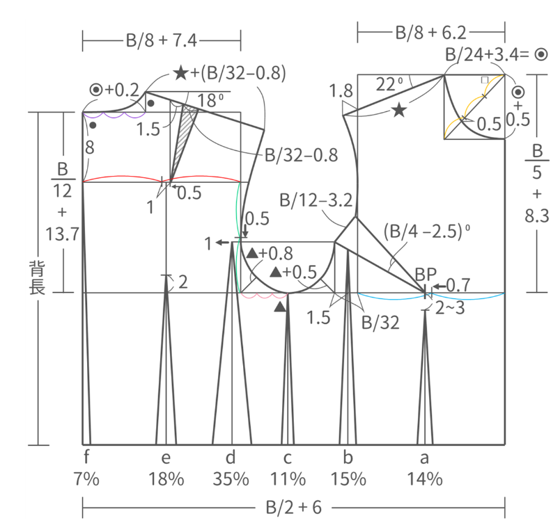
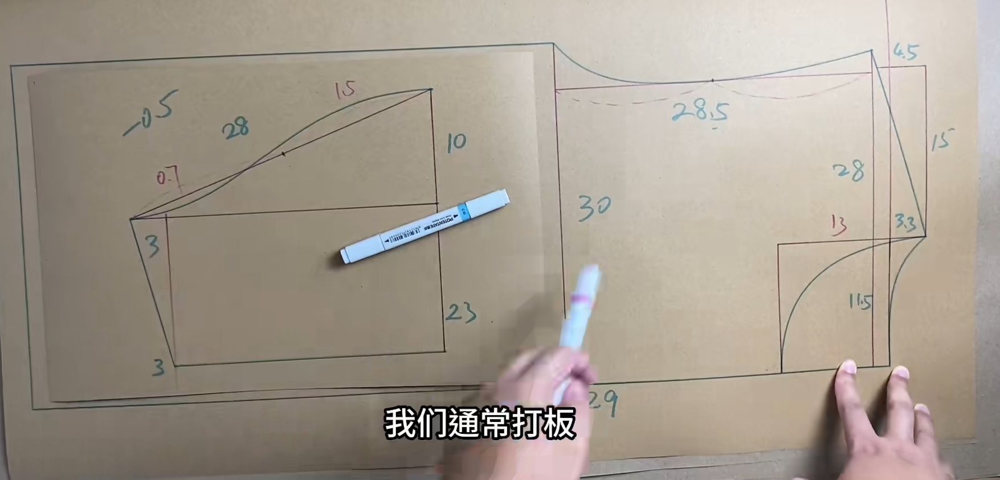
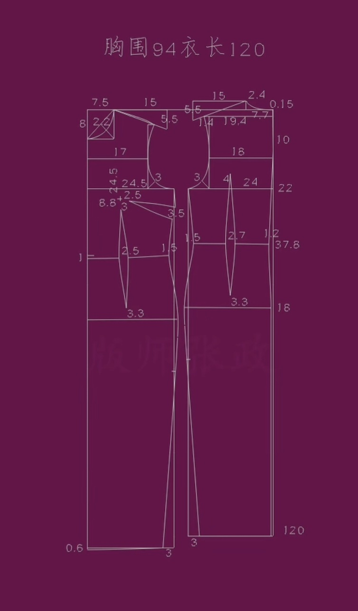
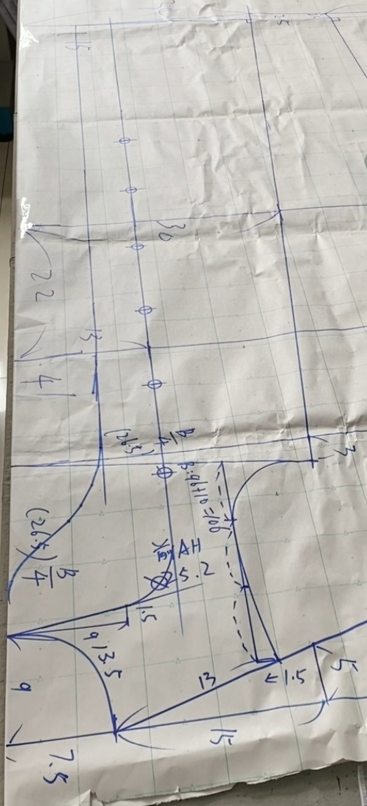
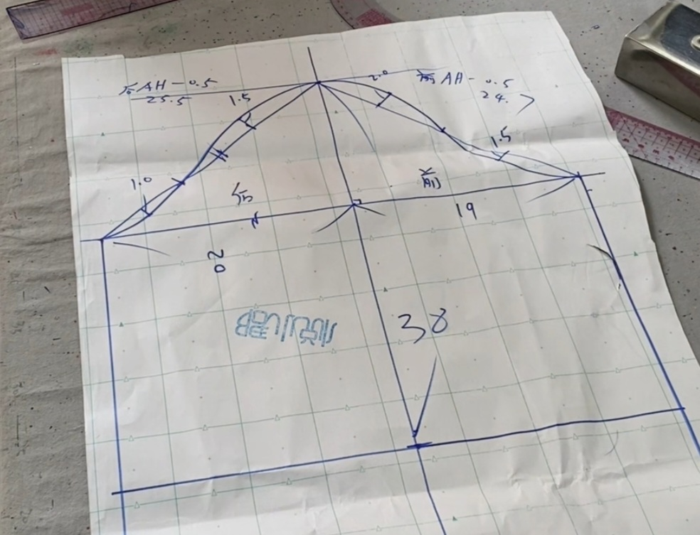
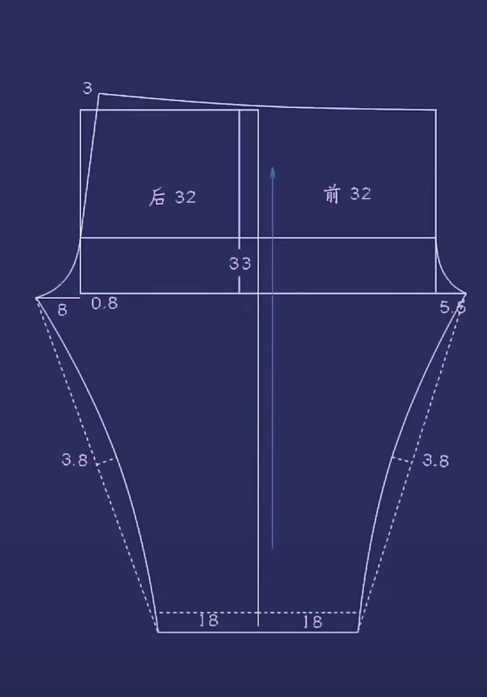

###  [<< back](./index.md)
# 女装新文化原型

# 女装新文化原型的绘制方法
<<<<<<< HEAD
- [method](https://www.zhihu.com/tardis/zm/art/188759932?source_id=1003)

# 大码男T
- [男T](./Images/bigsizeT.jpg)

# 旗袍
- [旗袍](./Images/qipao.jpg)

# 上衣制版（宽松）
- [上衣前片](./Images/top.jpg)
- [上衣前片省](./Images/sang.jpg)
- [袖子](./Images/sleeve.jpg)
=======
[method](https://www.zhihu.com/tardis/zm/art/188759932?source_id=1003)

# 大码男T
- 

# 旗袍
- 

# 上衣制版（宽松）
- 
- 
- 

# 睡裤制版
- 
- 
>>>>>>> fc807080eb89611bffd17fe3dd52ed6a68e9ed5f
