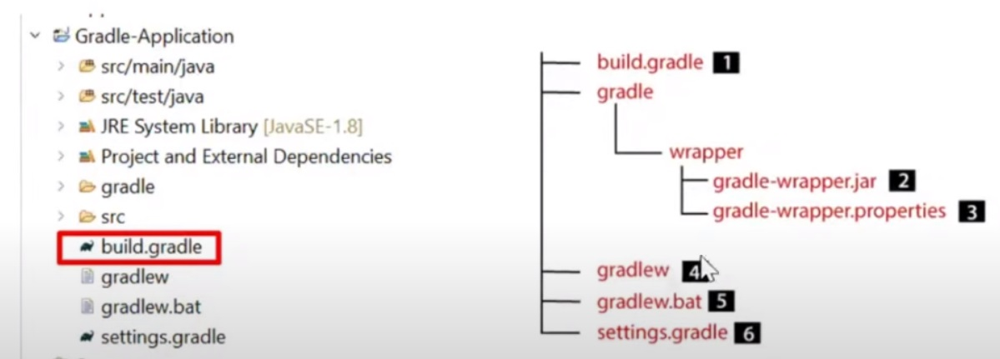
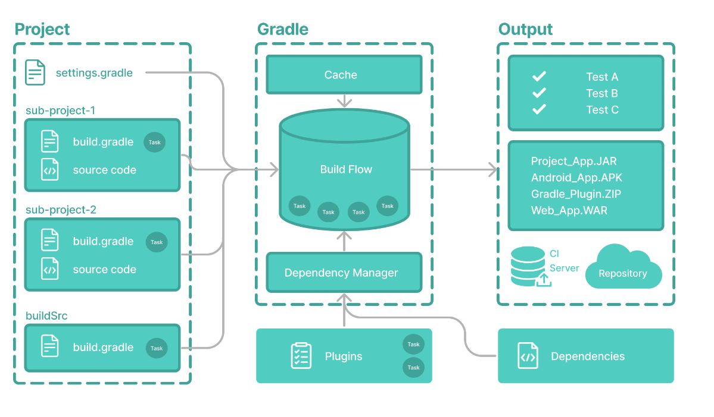
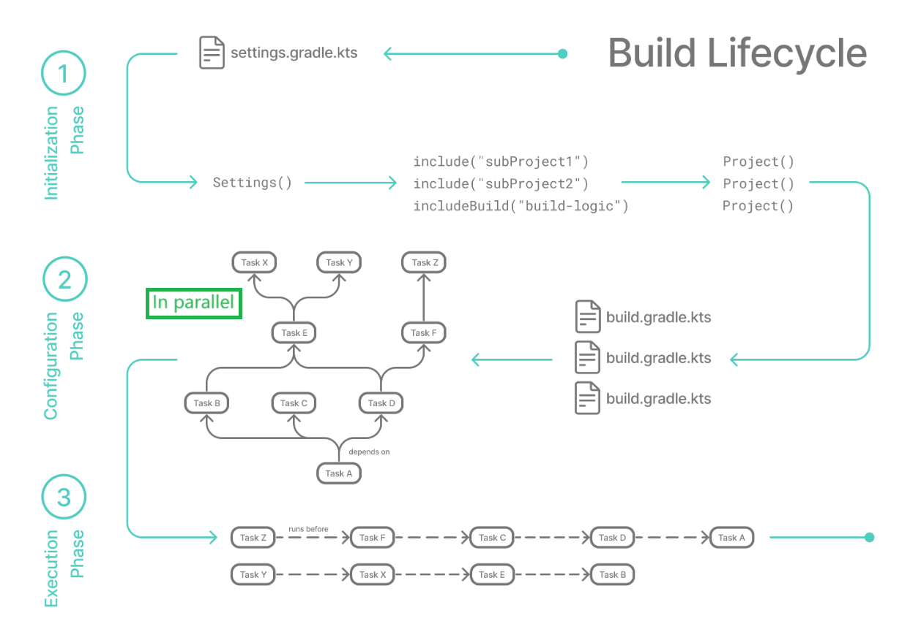

###  [<< back](./index.md)
# Gradle knowledge
Best tool for building Java projects
# Installation
  - Download package
  - Unzip and create a new environment variable for it
# Init
  - Gradle init: make choices in the steps
  - 
# Gradle [knowledge](https://docs.gradle.org/8.5/userguide/userguide.html)

# Gradle add a lib to project
  - build.gradle

  ```groovy
  repositories {
    // Use Maven Central for resolving dependencies.
    mavenCentral()
  }

  dependencies {
    // Use JUnit  Jupiter for testing.
    testImplementation 'org.junit.jupiter:junit-jupiter:5.9.1'

    // This dependency is used by the application.
    implementation 'com.google.guava:guava:31.1-jre'

    implementation 'org.seleniumhq.selenium:selenium-java:4.17.0'   
  }

  application {
    // Define the main class for the application.
    mainClass = 'javaproject.App'
  }

  tasks.named('test') {
    // Use JUnit Platform for unit tests.
    useJUnitPlatform()
  }
  ```
# run
  - Run with gradle 'gradle run --info'
  - Run with gradle wrapper './gradlew run --info'

# gradle workflow
  

# gradle lifecycle
  