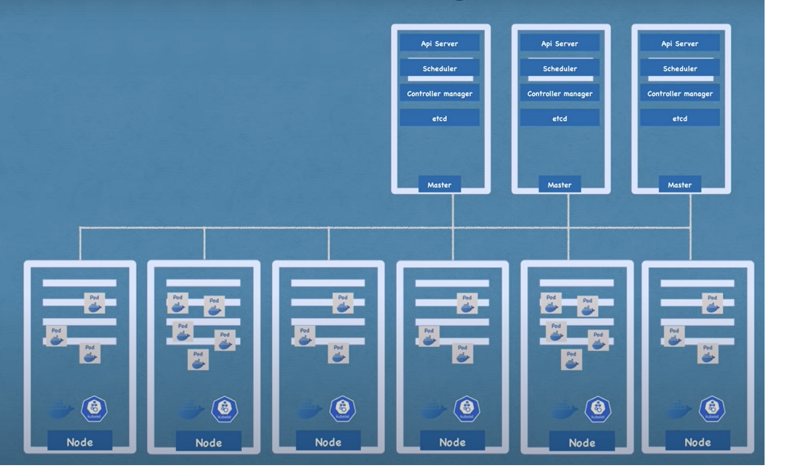
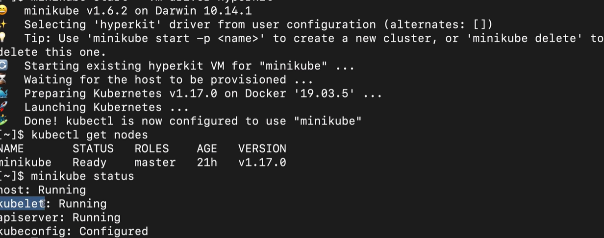

# K8s knowledge
  Learned from youtube posted by nana  [k8s video](https://www.youtube.com/watch?v=X48VuDVv0do)  
# Overview of k8s
  - Open source container orchastration tool
  - Developed by google
  - Helped you to manage containerized applications in different development environment (local,server,cloud or hybrid environment)
  - New trend of future development increased usage of container and it is really difficult to manage containers especially there are a lot of containers to be managed, so k8s comes up to solve this problem.
  - K8s provides 
      High availability or no downtime. 
      Scalability and high performance. 
      Disaster recovery or backup and restore. 
# K8s basic components
  - Node  (*Worker node or master node.*)
  - Pod (*Small unit of k8s, abstraction over container, usually one application per Pod, each pod get its own internal ip address.*)
  - Container (*Can die easily and each time it will get a new ip address so it is not easy to manage here service comes up to solve this problem.*)
  - Service (*Internal or external service.*)
  - Ingress (*Forward request to service.*)
  - Configmap 9*Configuration of service and others.*)
  - Secret (*Store confidential data and it just works like configmap.*)
  - Volume for data storage (*Database data or log data has to be persistent.*)
  - Replica (*Can be configured to create a replica pod.*)
  - Deployment (*All the pod or container will be created by deployment and replica will be configured within a deployment.*)
  - Stateful set (*For application like databases such as mySQL, mongo DB, elastic search etc.*)  **It is really tedious to manage a stateful set so databases normally will be hosted outside k8s**      
# K8s architecture  

## Master processes 
### API Server
    - Is like a cluster gateway and acts as a gatekeeper for authentication. 
### Scheduler 
    - Decides which worker node will be scheduled in an intelegient way and Kubelet in worker node will acutally schedule it.
### Controller Manager 
    - Detects state change such as pad dies and tells the schudler to notice it.
### etcd 
    - Is Key-value store for the cluster and application data is not stored here.
## Worker processes
### Kubelet 
    - Interacts with both the container and node.
### Kube Proxy
    - Will forward request from node to node and avoiding the overhead of network.
### Container runtime
    - Is runtime for the containers inside pod.
# Minikube & Kubectl
## Minikube
### What is minikube?
    One node which has both master and worker processes running and has container runtime pre-installed.
        - Creates virtual box on your labtop
        - Node runs in that virtual box
        - 1 Node k8s cluster
        - For testing purposes
### Installation of minikube
    - Install hypervisor first.
    - Install minikube and kubectl will be installed as well.
### Minikube commands

Start a cluster: `minikube start --vm-driver=hyperkit`
    
## Kubectl
### What is kubectl?
   It is a command line tool for k8s cluster
        - CLI (kubectl) to talk to API server other than UI or API.
        - Kubectl is the tool for any cluster such as cloud cluster or hybrid cluster.
### Kubectl basic commands
  - Create a deployment: `kubectl deployment nginx-deployment --image=nginx`
  - Get replicaset: `kubectl get replicaset`
  - Get pod: `kubctl get pod`
  - Edit a deployment: `kubectl edit deployment nginx-deployment`
  - Delete a deployment: `kubectl delete deployment nginx-deployment` 
  - Get status of different k8s components: `kubectl get nodes | pod | services | replicaset | deployment`
  - Debug pods(*Log to console*): `kubectl logs [log name]`
  - Debug pods (*Get interactive terminal*): `kubectl exec -it [pod name] --bin/bash` 
  - Apply a configuration for a deployment: `kubectl apply -f nginx-deployment.yaml`
  - Basic deployment config file:
    ```yml
    apiVersion: apps/v1
    kind: Deployment
    metadata:
      name: nginx-deployment
      labels:
        app: nginx
    spec:
      replicas: 2
      selector:
       matchLabels:
          app: nginx
      template:
       metadata:
          labels:
            app: nginx
        spec:
          containers:
          - name: nginx
            image: nginx:1.16
            ports:
            - containerPort: 8080
    ```
# K8s yaml configuration file explanation
## 3 parts of configuration file
### metadata
```yml
apiVersion: apps/v1
kind: Deployment
metadata:
  annotations:
    deployment.kubernetes.io/revision: "1"
    kubectl.kubernetes.io/last-applied-configuration: |
      {"apiVersion":"apps/v1","kind":"Deployment","metadata":{"annotations":{},"labels":{"app":"nginx"},"name":"nginx-deployment","namespace":"default"},"spec":{"replicas":2,"selector":{"matchLabels":{"app":"nginx"}},"template":{"metadata":{"labels":{"app":"nginx"}},"spec":{"containers":[{"image":"nginx:1.16","name":"nginx","ports":[{"containerPort":8080}]}]}}}}
  creationTimestamp: "2020-01-24T10:54:56Z"
  generation: 1
  labels:
    app: nginx
  name: nginx-deployment
  namespace: default
  resourceVersion: "96574"
  selfLink: /apis/apps/v1/namespaces/default/deployments/nginx-deployment
  uid: e1075fa3-6468-43d0-83c0-63fede0dae51
```
### specification

```yml
spec:
  progressDeadlineSeconds: 600
  replicas: 2
  revisionHistoryLimit: 10
  selector:
    matchLabels:
      app: nginx
  strategy:
    rollingUpdate:
      maxSurge: 25%
      maxUnavailable: 25%
    type: RollingUpdate
  template:
    metadata:
      creationTimestamp: null
      labels:
        app: nginx
    spec:
      containers:
      - image: nginx:1.16
        imagePullPolicy: IfNotPresent
        name: nginx
        ports:
        - containerPort: 8080
          protocol: TCP
        resources: {}
        terminationMessagePath: /dev/termination-log
        terminationMessagePolicy: File
      dnsPolicy: ClusterFirst
      restartPolicy: Always
      schedulerName: default-scheduler
      securityContext: {}
      terminationGracePeriodSeconds: 30
```
### status (current status = or ！= desired status)

```yml
status:
  availableReplicas: 2
  conditions:
  - lastTransitionTime: "2020-01-24T10:54:59Z"
    lastUpdateTime: "2020-01-24T10:54:59Z"
    message: Deployment has minimum availability.
    reason: MinimumReplicasAvailable
    status: "True"
    type: Available
  - lastTransitionTime: "2020-01-24T10:54:56Z"
    lastUpdateTime: "2020-01-24T10:54:59Z"
    message: ReplicaSet "nginx-deployment-7d64f4b574" has successfully progressed.
    reason: NewReplicaSetAvailable
    status: "True"
    type: Progressing
  observedGeneration: 1
  readyReplicas: 2
  replicas: 2
  updatedReplicas: 2
```
## Connecting deployments to Service to Pods
### labels
### selectors
### examples
#### service yaml

```yml
apiVersion: v1
kind: Service
metadata:
  name: nginx-service
spec:
  selector:
    app: nginx
  ports:
    - protocol: TCP
      port: 80
      targetPort: 808
```
#### deployment yaml

```yml
apiVersion: apps/v1
kind: Deployment
metadata:
  name: nginx-deployment
  labels:
    app: nginx
spec:
  replicas: 2
  selector:
    matchLabels:
      app: nginx
  template:
    metadata:
      labels:
        app: nginx
    spec:
      containers:
      - name: nginx
        image: nginx:1.16
        ports:
        - containerPort: 8080
```
#### ingress yaml

```yml
apiVersion: networking.k8s.io/v1
kind: Ingress
metadata:
  name: dashboard-ingress
  namespace: kubernetes-dashboard
  annotations:
    kubernetes.io/ingress.class: "nginx"
spec:
  rules:
  - host: dashboard.com
    http:
      paths:
      - path: /
        pathType: Exact  
        backend:
          service:
            name: kubernetes-dashboard
            port: 
              number: 80
```
## Configmap and secret

```yml
apiVersion: v1
kind: ConfigMap
metadata:
  name: mongodb-configmap
data:
  db_host: mongodb-service
 
---
apiVersion: v1
kind: Secret
metadata:
  name: mongodb-secret
type: Opaque
data:
  username: dXNlcm5hbWU=
  password: cGFzc3dvcmQ=

---
apiVersion: apps/v1
kind: Deployment
metadata:
  name: mongodb
  labels:
    app: mongodb
spec:
  replicas: 1
  selector:
    matchLabels:
      app: mongodb
  template:
    metadata:
      labels:
        app: mongodb
    spec:
      containers:
      - name: mongodb
        image: mongo
        ports:
        - containerPort: 27017
        env:
        - name: MONGO_INITDB_ROOT_USERNAME
          valueFrom:
            secretKeyRef:
              name: mongodb-secret
              key: username
        - name: MONGO_INITDB_ROOT_PASSWORD
          valueFrom:
            secretKeyRef:
              name: mongodb-secret
              key: password
              
---
apiVersion: v1
kind: Service
metadata:
  name: mongodb-service
spec:
  selector:
    app: mongodb
  ports:
    - protocol: TCP
      port: 27017
      targetPort: 27017
  
---
apiVersion: apps/v1
kind: Deployment
metadata:
  name: mongo-express
  labels:
    app: mongo-express
spec:
  replicas: 1
  selector:
    matchLabels:
      app: mongo-express
  template:
    metadata:
      labels:
        app: mongo-express
    spec:
      containers:
      - name: mongo-express
        image: mongo-express
        ports:
        - containerPort: 8081
        env:
        - name: ME_CONFIG_MONGODB_ADMINUSERNAME
          valueFrom:
            secretKeyRef:
              name: mongodb-secret
              key: username
        - name: ME_CONFIG_MONGODB_ADMINPASSWORD
          valueFrom:
            secretKeyRef:
              name: mongodb-secret
              key: password
        - name: ME_CONFIG_MONGODB_SERVER 
          valueFrom: 
            configMapKeyRef:
              name: mongodb-configmap
              key: db_host
---
apiVersion: v1
kind: Service
metadata:
  name: mongo-express-service
spec:
  selector:
    app: mongo-express
  type: LoadBalancer  
  ports:
    - protocol: TCP
      port: 8081
      targetPort: 8081
      nodePort: 30000
```
# K8s namespaces

# Package manager - helm

# Persistent data in K8s with volumes
## Deployment with multiple volumes 

```yml
apiVersion: apps/v1
kind: Deployment
metadata:
  name: elastic
spec:
  selector:
    matchLabels:
      app: elastic
  template:
    metadata:
      labels:
        app: elastic
    spec:
      containers:
      - image: elastic:latest
        name: elastic-container
        ports:
        - containerPort: 9200
        volumeMounts:
        - name: es-persistent-storage
          mountPath: /var/lib/data
        - name: es-secret-dir
          mountPath: /var/lib/secret
        - name: es-config-dir
          mountPath: /var/lib/config
      volumes:
      - name: es-persistent-storage
        persistentVolumeClaim:
          claimName: es-pv-claim
      - name: es-secret-dir
        secret:
          secretName: es-secret 
      - name: es-config-dir
        configMap:
          name: es-config-map
```
## Persistent volume claims
```yml
kind: PersistentVolumeClaim
apiVersion: v1
metadata:
  name: pvc-name
spec:
  storageClassName: manual
  volumeMode: Filesystem
  accessModes:
    - ReadWriteOnce
  resources:
    requests:
      storage: 10Gi

---
apiVersion: v1
kind: PersistentVolumeClaim
metadata:
     name: mypvc
spec:
     accessModes:
     - ReadWriteOnce
     resources:
       requests:
         storage: 100Gi
     storageClassName: storage-class-name
```
## Persistent volumes
```yml
apiVersion: v1
kind: PersistentVolume
metadata:
  name: pv-name
spec:
  capacity:
    storage: 5Gi
  volumeMode: Filesystem
  accessModes:
    - ReadWriteOnce
  persistentVolumeReclaimPolicy: Recycle
  storageClassName: slow
  mountOptions:
    - hard
    - nfsvers=4.0
  nfs:
    path: /dir/path/on/nfs/server
    server: nfs-server-ip-address

---
apiVersion: v1
kind: PersistentVolume
metadata:
  name: test-volume
  labels:
    failure-domain.beta.kubernetes.io/zone: us-central1-a__us-central1-b
spec:
  capacity:
    storage: 400Gi
  accessModes:
  - ReadWriteOnce
  gcePersistentDisk:
    pdName: my-data-disk
    fsType: ext4

---
apiVersion: v1
kind: PersistentVolume
metadata:
  name: example-pv
spec:
  capacity:
    storage: 100Gi
  volumeMode: Filesystem
  accessModes:
  - ReadWriteOnce
  persistentVolumeReclaimPolicy: Delete
  storageClassName: local-storage
  local:
    path: /mnt/disks/ssd1
  nodeAffinity:
    required:
      nodeSelectorTerms:
      - matchExpressions:
        - key: kubernetes.io/hostname
          operator: In
          values:
          - example-node
```
## Pods with colume
```yml
apiVersion: v1
kind: Pod
metadata:
  name: mypod
spec:
  containers:
    - name: myfrontend
      image: nginx
      volumeMounts:
      - mountPath: "/var/www/html"
        name: mypd
  volumes:
    - name: mypd
      persistentVolumeClaim:
        claimName: pvc-name

---
apiVersion: v1
kind: Pod
metadata:
  name: mypod
spec:
  containers:
    - name: busybox-container
      image: busybox
      volumeMounts:
        - name: config-dir
          mountPath: /etc/config
  volumes:
    - name: config-dir
      configMap:
        name: bb-configmap

---
apiVersion: v1
kind: Pod
metadata:
  name: mypod
spec:
  containers:
  - name: busybox-container
    image: busybox
    volumeMounts:
    - name: secret-dir
      mountPath: /etc/secret
      readOnly: true
  volumes:
  - name: secret-dir
    secret:
      secretName: bb-secret
```
## Storage class
```yml
apiVersion: storage.k8s.io/v1
kind: StorageClass
metadata:
  name: storage-class-name
provisioner: kubernetes.io/aws-ebs
parameters:
  type: io1
  iopsPerGB: "10"
  fsType: ext4

---
apiVersion: v1
kind: PersistentVolumeClaim
metadata:
     name: mypvc
spec:
     accessModes:
     - ReadWriteOnce
     resources:
       requests:
         storage: 100Gi
     storageClassName: storage-class-name
```
# Deploy stateful apps with statefulsets
