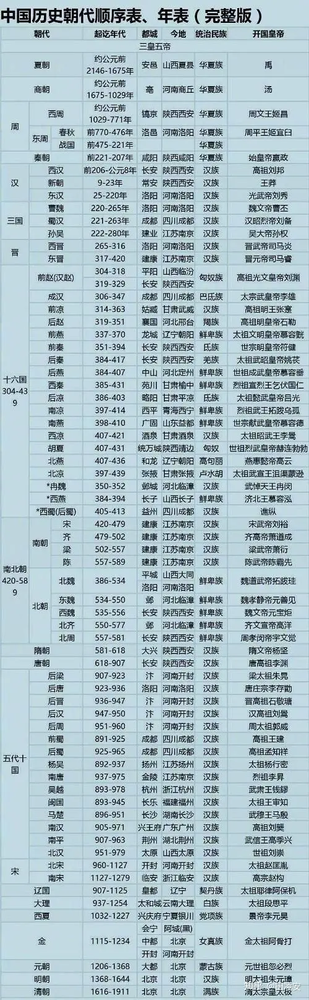

###  [<< back](./index.md)
# 历史图表

# 具体朝代年份

- 夏朝：约公元前2029年-约公元前1559年，共计：471年

- 商朝：约公元前1559年-约公元前1046年，共计：438年

- 周朝：约公元前1046年-公元前256年，分为西周、东周，东周又分为春秋、战国，共计：867年

- 秦朝：公元前221-公元前206年，前221年秦王嬴政统一六国，首称皇帝，共计：16年

- 西楚：公元前206年-公元前202年，西楚霸王项羽，共计：5年

- 西汉：公元前202年-公元8年，汉高祖刘邦，共计：210年

- 新朝：公元8年腊月-公元23年10月6日，新太祖建兴帝王莽，共计：16年

- 玄汉：公元23-25年，汉更始帝刘玄，共计：3年

- 东汉：公元25-220年，汉光武帝刘秀，共计：196年

- 三国：公元220-280年，魏、蜀、吴三足鼎立，共计：61年

- 晋朝：公元265-420年，分为西晋(265-316年)、东晋(317-420年) ，共计：156年

- 南北朝：公元420-589年，共计：170年

- 隋朝：公元581-公元618年，隋文帝杨坚，共计：38年

- 唐朝：公元618-907年，唐高祖李渊，共计：290年

- 五代：公元907-960年，后梁、后唐、后晋、后汉、后周，共计：54年

- 十国：公元891-979年，共计：89年

- 宋朝：公元960-1279年，分为北宋(公元960-1127年)、南宋(公元1127-1279年)，共计：320年

- 元朝：公元1271年-1368年，元太祖孛儿只斤·铁木真，共计：98年

- 明朝：公元1368-1644年，明太祖朱元璋，共计：277年

- 清朝：公元1644-1912年，清太祖爱新觉罗·努尔哈赤，共计：268年

- 中华民国：公元1912-1949，孙中山，共计：37年

- 中华人民共和国：公元1949年-至今

# 总览
中国在1912年建立民国以前，最高统治权力是以家族世袭为主的，这些世袭王族的更替构成了中国朝代。各朝代以“王”或“皇帝”为最高统治者，因为世袭相承，常称为“家天下”。

我国历史悠久，朝代更零星纷繁。每朝的创建者要首手办的第一件事就是确立国号（朝代名称）。国号就是一个国家的称号。《史记·五帝本纪》：“自黄帝至舜禹，皆同姓而异其国号，以章明德。”

公元前21世纪，中国最早的国家夏朝出现。东周推进了生产力发展和社会变革，思想上形成百家争鸣的局面。公元前221年，秦始皇建立了中国历史上第一个统一的专制主义中央集权帝国—秦朝，西汉进一步巩固和发展了大一统的局面。

三国两晋南北朝时，中国陷入分裂割据局面，五胡乱华期间，异族融于中国趋势加强，诸多民族在分立政权的冲突中逐渐汇聚。隋唐时期，中央与边疆少数民族联系更为密切，经济繁荣、科技文化高度发展。宋元时期，多元文化碰撞交融，经济、科技发展到新的高度。明朝鼎盛时期，社会经济高度发展，明末在江南地区出现资本主义萌芽。

中国历史悠久，自黄帝部落的姬轩辕（也称公孙轩辕）时期算起约有5000年；从三皇五帝算起约有4600年；自夏朝算起约有近4100年；从中国第一次大统一的中央集权制的秦朝算起约有2240年。中国历经多次政权演变和朝代更迭，也曾是世界上最强大的国家，经济、文化、科技世界瞩目。

中国又是一个有着辉煌文明的古老国度。从步入文明的门槛之日起， 历代统治者，以其各自的政绩在历史舞台上演出了内容不同的剧目，或名垂青史，或遗臭万年。

在数千年的古代历史上，中华民族以不屈不挠的顽强意志和勇于探索的聪明才智，谱写了波澜壮阔的历史画卷，创造了同期世界历史上极其灿烂的物质文明与精神文明。万里长城、大运河、明清故宫以及多姿多彩的各种出土文物，无不反映出大胆、高超的生产技术

中国人民同时在思想文化、科学技术领域产生了无数杰出的人物，创造出无比博大、深厚的业绩；而包括指南针、造纸术、火药和印刷术这四大发明在内的无数科技成就，更使全人类受益匪浅。
