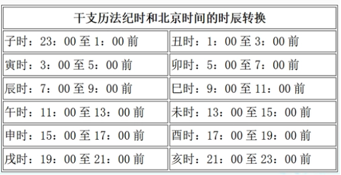
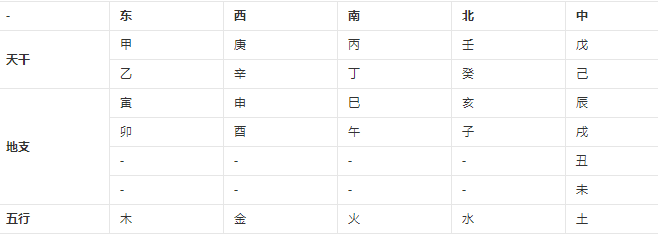

###  [<< back](./index.md)
# 内容总览
天干地支相关知识

# 天干
  - 十天干发音：
    甲（jiǎ）、乙（yǐ）、丙（bǐng）、丁（dīng）、戊（wù）、己（jǐ）、庚（gēng）、辛（xīn）、壬（rén）、癸（guǐ）
  - 天干五行分为阴与阳：
    甲木、乙木、丙火、丁火、戊土、己土、庚金、辛金、壬水、癸水，(*其中甲 丙 戊 庚 壬为阳性，乙丁己辛癸为阴性*)
    
# 地支
  - 十二地支发音：
    子（zǐ）、丑（chǒu）、寅（yín）、卯（mǎo）、辰（chén）、巳（sì）、午（wǔ）、未（wèi）、申（shēn）、酉（yǒu）、戌（xū）、亥（hài）。
  - 十二地支对应十二生肖：
    子：鼠；丑：牛；寅：虎；卯：兔；辰：龙；巳：蛇；
    午：马；未：羊；申：猴；酉：鸡；戌：狗；亥：猪。
    
# 年柱的计算方法
  - 天干：（公元年-3）%10
  - 地支：（公元年-3）%12
  - 例子： 
  ```
  $year = 1977
  ($year-3)%10 = 4(丁)
  ($year-3)%10 = 6(巳)
  所以1977是《丁巳》年
  ```

# 月柱的计算方法
  - 天干地支依据一下诗为依据 （注意为农历）
  ```
  甲巳之年丙做首 - 年柱天干为甲，为己的，月柱的天干从‘丙’开始推算，地址根据所在的月份从寅开始往后推算。
  乙庚之岁戊为头 - 年柱天干为乙，为庚的，月柱的天干从‘戊’开始推算，地址根据所在的月份从寅开始往后推算。
  丙辛岁首寻庚起 - 年柱天干为丙，为辛的，月柱的天干从‘庚’开始推算，地址根据所在的月份从寅开始往后推算。
  丁壬壬位顺行流 - 年柱天干为丁，为壬的，月柱的天干从‘壬’开始推算，地址根据所在的月份从寅开始往后推算。
  若言戊癸何方发，甲寅之上好追求 - 年柱天干为‘戊’，为‘癸’的，第一个月为‘甲寅’，其余月份依次往后推算。
  ```
  
  - 例子
  ```
  以1977年4月初六为例，1977年为‘丁巳’年，那么天干从‘壬’开始推算，4月天干为‘乙’，地支为‘巳’，所以月柱为‘乙巳’
  ```
  
# 日柱的计算方法
  - 口诀：
　　-  乘五除四九加日，双月间隔三十天。一二自加整少一，三五七八十尾前。
  
　- 口诀解密：
　　-  能被4整除年份：
　　  -   单月（1、3、5、7、9、11月） A=0、0、1、2、4、5。
　　  -   双月（2、4、6、8、10、12月 B=1、1、2、3、4、5。

　　-  不能被4整除年份：
　　  -   单月（1、3、5、7、9、11月） a=1、0、1、2、4、5。
　　  -   双月（2、4、6、8、10、12月 b=2、1、2、3、4、5。

　　-  最后代入系数
　　  -   单月：（年数×5、25＋09＋日数＋A或a）÷60＝商＋余
　　  -   双月：（年数×5、25＋39＋日数＋B或b）÷60＝商＋余
- 例子
```
以1977年4月初六为例
1977%4 = 1
不被整除，4月为双月，所以系数为1
利用公式 （77*5 + 77/4 + 9 + 6 + 1） % 60 = 
（这里需要补充，稍后加入，主要是这个公示的正确性）
```

# 时柱的计算方法
 - 地支每日不变
    -   
    
 - 推出天干地方法
    -  通过“日上起时表”直接查询每日时辰的天干。
    -  通过“五鼠遁诀”推出时干。
    -  可以用“逢龙即化诀”推出时干。
 - 日上起时表
   -   

# 干支与五行方位的对应
  -   
